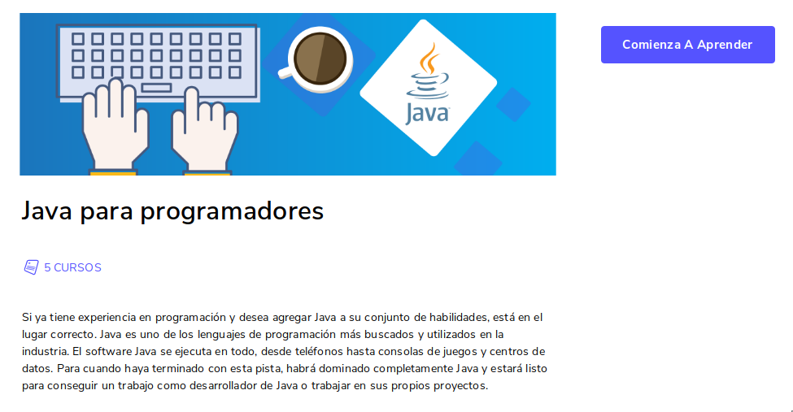

  

[Cursos intensivo y completo de java](https://www.educative.io/courses/the-complete-java-crash-course)

> Todas las funciones en Java se denominan métodos, Las definiciones de métodos se agrupan en clases .

> lenguaje de tipo estático(debe crear explícitamente cada variable e indicar qué tipo de datos antes de usarla)

> La mayoria de instrucciones terminan en punto y coma, las definiciones de métodos y clases no.

> System.out.println("esto se imprime");.

## Convencion de identificador

Para variables se usa camelCase

## Format
Permite que noe stemos usando concatenaciones.

`System.out.format("%f is an approximation of pi.", 3.14159).` %f indica que recibira ahi un coma flotante, para un entero usa %d si %.2f el numero sera de 2 digitos despues del punto

## Clase
> clase es una colección de métodos

## Métodos
[Métodos státicos y no státicos](https://github.com/jhonPariona/curso-java-educative/tree/main/metodos#m%C3%A9todos)

